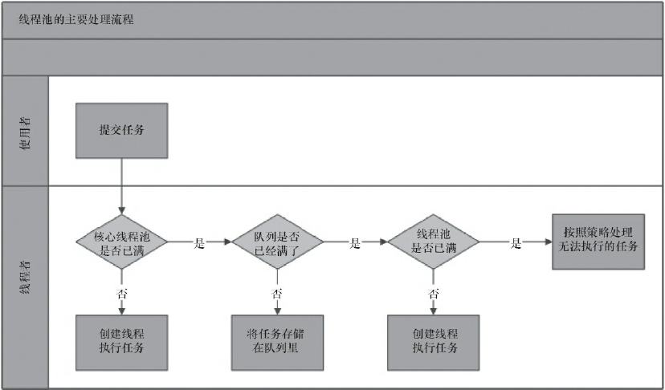
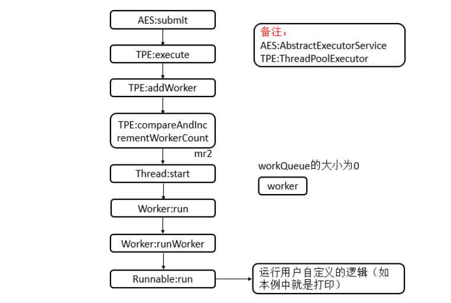
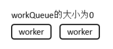
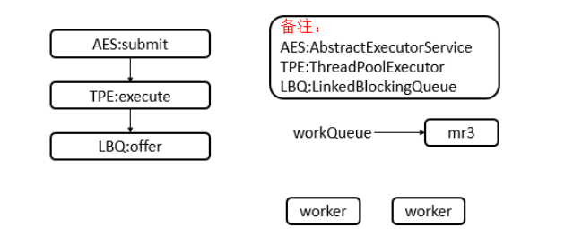
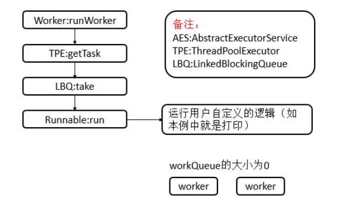
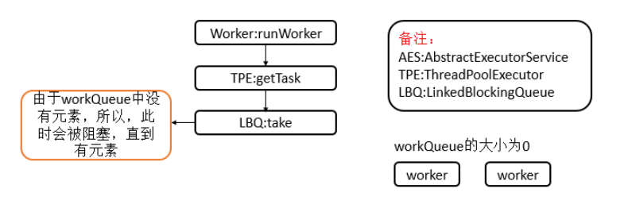
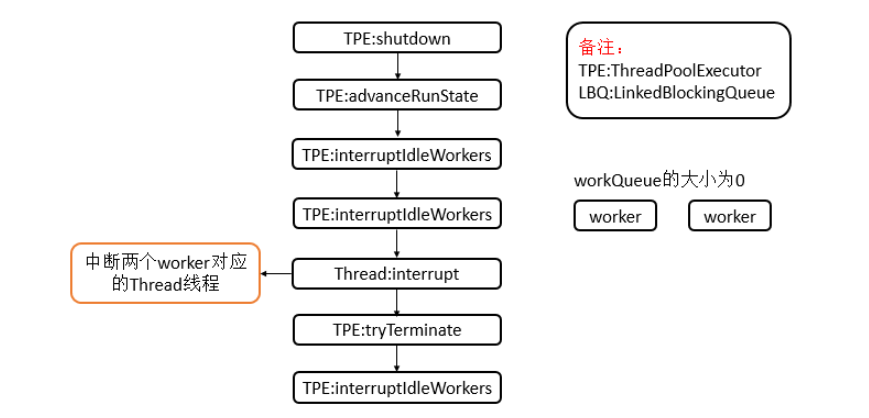
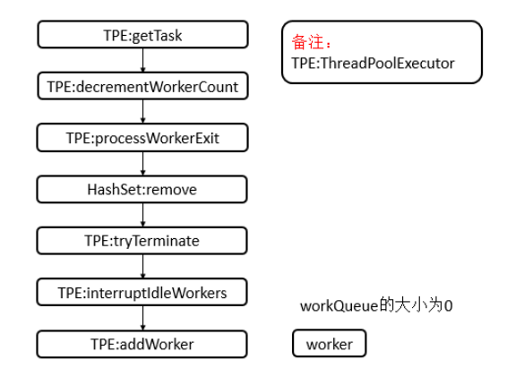
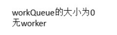

## ThreadPoolExecutor源码实现即Java中的线程池
Java中的线程池是运用场景最多的并发框架，几乎所有需要异步或并发执行任务的程序
都可以使用线程池。在开发过程中，合理地使用线程池能够带来3个好处。

- 降低资源消耗。通过重复利用已创建的线程降低线程创建和销毁造成的消耗
- 提高响应速度。当任务到达时，任务可以不需要等到线程创建就能立即执行
- 提高线程的可管理性。线程是稀缺资源，如果无限制地创建，不仅会消耗系统资源，
  还会降低系统的稳定性，使用线程池可以进行统一分配、调优和监控。但是，要做到合理利用
  线程池，必须对其实现原理了如指掌
### 一、实现原理
1. 原理概述
   1. 处理流程
      1. 线程池判断核心线程池里的线程是否都在执行任务。如果不是，则创建一个新的工作
        线程来执行任务。如果核心线程池里的线程都在执行任务，则进入下个流程
      2. 线程池判断工作队列是否已经满。如果工作队列没有满，则将新提交的任务存储在这
         个工作队列里。如果工作队列满了，则进入下个流程
      3. 线程池判断线程池的线程是否都处于工作状态。如果没有，则创建一个新的工作线程
         来执行任务。如果已经满了，则交给饱和策略来处理这个任务
   2. 流程示意图
      
2. 源码分析
   1. 继承关系
      

      <font color='red'>**ThreadPoolExecutor继承自AbstractExecutorService，AbstractExecuetorService提供了ExecutorService执行方法的默认实现。**</font>
   2. 内部类

      核心内部类为Worker，其对资源进行了复用，减少创建线程的开销，还有若干个策略类。

      

      说明：
          我们看到Worker继承了AQS抽象类并且实现了Runnable接口，其是ThreadPoolExecutor的核心内部类。

          <font color='red'>**而对于AbortPolicy，用于被拒绝任务的处理程序，它将抛出 RejectedExecutionException、CallerRunsPolicy，
          用于被拒绝任务的处理程序，它直接在 execute 方法的调用线程中运行被拒绝的任务；如果执行程序已关闭，则会丢弃该任务。
          DiscardPolicy，用于被拒绝任务的处理程序，默认情况下它将丢弃被拒绝的任务。
          DiscardOldestPolicy，用于被拒绝任务的处理程序，它放弃最旧的未处理请求，然后重试 execute；如果执行程序已关闭，则会丢弃该任务。**</font>

          以上这些都是拒绝任务提交时的所采用的不同策略。
      1. Worker类的继承关系
         ```
            private final class Worker extends AbstractQueuedSynchronizer implements Runnable {}
         ```

         
      2. Worker类属性

         ```
                 private static final long serialVersionUID = 6138294804551838833L;
                 // worker所对应的线程
                 final Thread thread;
                 // worker所对应的第一个任务
                 Runnable firstTask;
                 // 已完成任务数量
                 volatile long completedTasks;
         ```
      3. Worker类构造函数
         ```
                 Worker(Runnable firstTask) {
                     setState(-1); // inhibit interrupts until runWorker
                     this.firstTask = firstTask;
                     this.thread = getThreadFactory().newThread(this);
                 }
         ```

         说明：用于构造一个worker对象，并设置AQS的state为-1，同时初始化了对应的域
      4. Worker类核心函数
         ```
                 // 重写了Runnable的run方法
                 public void run() {
                     runWorker(this);
                 }
                 
                 // 是否被独占,0代表未被独占，1代表被独占
                 protected boolean isHeldExclusively() {
                     return getState() != 0;
                 }
         
                 protected boolean tryAcquire(int unused) {
                     if (compareAndSetState(0, 1)) {
                         setExclusiveOwnerThread(Thread.currentThread());
                         return true;
                     }
                     return false;
                 }
         
                 protected boolean tryRelease(int unused) {
                     setExclusiveOwnerThread(null);
                     setState(0);
                     return true;
                 }
         
                 public void lock()        { acquire(1); }
                 public boolean tryLock()  { return tryAcquire(1); }
                 public void unlock()      { release(1); }
                 public boolean isLocked() { return isHeldExclusively(); }
         
                 void interruptIfStarted() {
                     Thread t;
                     if (getState() >= 0 && (t = thread) != null && !t.isInterrupted()) { // AQS状态大于等于0并且worker对应的线程不为null并且该线程没有被中断
                         try {
                             t.interrupt();
                         } catch (SecurityException ignore) {
                         }
                     }
                 }
         ```

         Worker的函数主要是重写了AQS的相应函数和重写了Runnable的run函数，重写的函数比较简单，具体的可以参见AQS的分析 [AbstractQueuedSynchronizer(AQS)源码实现](https://blog.csdn.net/weixin_39723544/article/details/86774397)
   3. 类的属性
      ```
          // 线程池的控制状态（用来表示线程池的运行状态（整形的高3位）和运行的worker数量（低29位））
          private final AtomicInteger ctl = new AtomicInteger(ctlOf(RUNNING, 0));
          // 29位的偏移量
          private static final int COUNT_BITS = Integer.SIZE - 3;
          // 最大容量（2^29 - 1）
          private static final int CAPACITY   = (1 << COUNT_BITS) - 1;
          
          // 线程运行状态，总共有5个状态，需要3位来表示（所以偏移量的29 = 32 - 3）
          private static final int RUNNING    = -1 << COUNT_BITS;
          private static final int SHUTDOWN   =  0 << COUNT_BITS;
          private static final int STOP       =  1 << COUNT_BITS;
          private static final int TIDYING    =  2 << COUNT_BITS;
          private static final int TERMINATED =  3 << COUNT_BITS;
          
          // 阻塞队列
          private final BlockingQueue<Runnable> workQueue;
          
          // 锁
          private final ReentrantLock mainLock = new ReentrantLock();
          
          // 存放工作线程集合
          private final HashSet<Worker> workers = new HashSet<Worker>();
          
          // 终止条件
          private final Condition termination = mainLock.newCondition();
      
          // 最大线程池容量
          private int largestPoolSize;
      
          // 已完成任务数量
          private long completedTaskCount;
      
          // 线程工厂
          private volatile ThreadFactory threadFactory;
          
          // 拒绝执行处理器
          private volatile RejectedExecutionHandler handler;
          
          // 线程等待运行时间
          private volatile long keepAliveTime;
          
          // 是否运行核心线程超时
          private volatile boolean allowCoreThreadTimeOut;
          
          // 核心池的大小
          private volatile int corePoolSize;
          
          // 最大线程池大小
          private volatile int maximumPoolSize;
          
          // 默认拒绝执行处理器
          private static final RejectedExecutionHandler defaultHandler =
              new AbortPolicy();
      
          private static final RuntimePermission shutdownPerm =
              new RuntimePermission("modifyThread");
      
          private final AccessControlContext acc;
      ```

      ctl为线程池的控制状态，用来表示线程池的运行状态（整形的高3位）和运行的worker数量（低29位）），其中，线程池的运行状态有如下几种:

      ```
                // 线程运行状态，总共有5个状态，需要3位来表示（所以偏移量的29 = 32 - 3）
                // RUNNING:接受新任务并且处理已经进入阻塞队列的任务
                // SHUTDOWN:不接受新任务，但是处理已经进入阻塞队列的任务
                // STOP:不接受新任务，不处理已经进入阻塞队列的任务并且中断正在运行的任务
                // TIDYING :所有的任务都已经终止，workerCount为0， 线程转化为TIDYING状态并且调用terminated钩子函数
                // TERMINATED:terminated钩子函数已经运行完成
                private static final int RUNNING    = -1 << COUNT_BITS;
                private static final int SHUTDOWN   =  0 << COUNT_BITS;
                private static final int STOP       =  1 << COUNT_BITS;
                private static final int TIDYING    =  2 << COUNT_BITS;
                private static final int TERMINATED =  3 << COUNT_BITS;
      ```

      由于有5种状态，最少需要3位表示，所以采用的AtomicInteger的高3位来表示，低29位用来表示worker的数量，即最多表示2^29 - 1.
   4. 类的构造函数
      ```
          public ThreadPoolExecutor(int corePoolSize,
                                    int maximumPoolSize,
                                    long keepAliveTime,
                                    TimeUnit unit,
                                    BlockingQueue<Runnable> workQueue) {
              this(corePoolSize, maximumPoolSize, keepAliveTime, unit, workQueue,
                   Executors.defaultThreadFactory(), defaultHandler);
          }
      
          public ThreadPoolExecutor(int corePoolSize,
                                    int maximumPoolSize,
                                    long keepAliveTime,
                                    TimeUnit unit,
                                    BlockingQueue<Runnable> workQueue,
                                    ThreadFactory threadFactory) {
              this(corePoolSize, maximumPoolSize, keepAliveTime, unit, workQueue,
                   threadFactory, defaultHandler);
          }
      
          public ThreadPoolExecutor(int corePoolSize,
                                    int maximumPoolSize,
                                    long keepAliveTime,
                                    TimeUnit unit,
                                    BlockingQueue<Runnable> workQueue,
                                    RejectedExecutionHandler handler) {
              this(corePoolSize, maximumPoolSize, keepAliveTime, unit, workQueue,
                   Executors.defaultThreadFactory(), handler);
          }
      
          public ThreadPoolExecutor(int corePoolSize,
                                    int maximumPoolSize,
                                    long keepAliveTime,
                                    TimeUnit unit,
                                    BlockingQueue<Runnable> workQueue,
                                    ThreadFactory threadFactory,
                                    RejectedExecutionHandler handler) {
              if (corePoolSize < 0 ||
                  maximumPoolSize <= 0 ||
                  maximumPoolSize < corePoolSize ||
                  keepAliveTime < 0)
                  throw new IllegalArgumentException();
              if (workQueue == null || threadFactory == null || handler == null)
                  throw new NullPointerException();
              this.acc = System.getSecurityManager() == null ?
                      null :
                      AccessController.getContext();
              this.corePoolSize = corePoolSize;
              this.maximumPoolSize = maximumPoolSize;
              this.workQueue = workQueue;
              this.keepAliveTime = unit.toNanos(keepAliveTime);
              this.threadFactory = threadFactory;
              this.handler = handler;
          }
          
      ```
      1. corePoolSize（线程池的基本大小）：当提交一个任务到线程池时，线程池会创建一个线
         程来执行任务，即使其他空闲的基本线程能够执行新任务也会创建线程，等到需要执行的任
         务数大于线程池基本大小时就不再创建。如果调用了线程池的prestartAllCoreThreads()方法，
         线程池会提前创建并启动所有基本线程。
      2. runnableTaskQueue（任务队列）：用于保存等待执行的任务的阻塞队列。可以选择以下几
         个阻塞队列。

         - ArrayBlockingQueue：是一个基于数组结构的有界阻塞队列，此队列按FIFO（先进先出）原
         则对元素进行排序。
         - LinkedBlockingQueue：一个基于链表结构的阻塞队列，此队列按FIFO排序元素，吞吐量通
         常要高于ArrayBlockingQueue。静态工厂方法Executors.newFixedThreadPool()使用了这个队列。
         - SynchronousQueue：一个不存储元素的阻塞队列。每个插入操作必须等到另一个线程调用
           移除操作，否则插入操作一直处于阻塞状态，吞吐量通常要高于Linked-BlockingQueue，静态工
           厂方法Executors.newCachedThreadPool使用了这个队列。
         - PriorityBlockingQueue：一个具有优先级的无限阻塞队列
      3. maximumPoolSize（线程池最大数量）：线程池允许创建的最大线程数。如果队列满了，并
         且已创建的线程数小于最大线程数，则线程池会再创建新的线程执行任务。值得注意的是，如
         果使用了无界的任务队列这个参数就没什么效果。
      4. ThreadFactory：用于设置创建线程的工厂，可以通过线程工厂给每个创建出来的线程设
         置更有意义的名字。使用开源框架guava提供的ThreadFactoryBuilder可以快速给线程池里的线
         程设置有意义的名字，代码如下。

         ```
            new ThreadFactoryBuilder().setNameFormat("XX-task-%d").build();
         ```
      5. RejectedExecutionHandler（饱和策略）：当队列和线程池都满了，说明线程池处于饱和状
         态，那么必须采取一种策略处理提交的新任务。这个策略默认情况下是AbortPolicy，表示无法
         处理新任务时抛出异常。在JDK 1.5中Java线程池框架提供了以下4种策略:

         - AbortPolicy：直接抛出异常
         - CallerRunsPolicy：只用调用者所在线程来运行任务
         - DiscardOldestPolicy：丢弃队列里最近的一个任务，并执行当前任务
         - DiscardPolicy：不处理，丢弃掉

         当然，也可以根据应用场景需要来实现RejectedExecutionHandler接口自定义策略。如记录
         日志或持久化存储不能处理的任务.
      6. keepAliveTime（线程活动保持时间）：线程池的工作线程空闲后，保持存活的时间。所以，
         如果任务很多，并且每个任务执行的时间比较短，可以调大时间，提高线程的利用率

         TimeUnit（线程活动保持时间的单位）：可选的单位有天（DAYS）、小时（HOURS）、分钟
         （MINUTES）、毫秒（MILLISECONDS）、微秒（MICROSECONDS，千分之一毫秒）和纳秒
         （NANOSECONDS，千分之一微秒）。
   5. 核心函数
      1. execute(Runnable command)

         ThreadPoolExecutor执行execute方法分下面4种情况:
         1. 如果当前运行的线程少于corePoolSize，则创建新线程来执行任务（注意，执行这一步骤
            需要获取全局锁）。
         2. 如果运行的线程等于或多于corePoolSize，则将任务加入BlockingQueue
         3. 如果无法将任务加入BlockingQueue（队列已满），则创建新的线程来处理任务（注意，执
            行这一步骤需要获取全局锁）。
         4. 如果创建新线程将使当前运行的线程超出maximumPoolSize，任务将被拒绝，并调用
            RejectedExecutionHandler.rejectedExecution()方法。

         ```
         public void execute(Runnable command) {
                 // 命令为null，抛出异常
                 if (command == null)
                     throw new NullPointerException();
                 
                 // 获取线程池中工作线程的数量和核心线程数做比较
                 // 如果小于就调用addWorker方法，
                 // 如果失败了会重新获取工作线程数量和线程池状态，成功就直接返回
                 int c = ctl.get();
                 if (workerCountOf(c) < corePoolSize) {
                     // 此时调用addWorker方法就是创建一个新的工作线程来执行这个任务
                     // 向addWorker方法传入参数true，会在addWorker方法里面继续将工作线程数量和核心线程数做比较
                     if (addWorker(command, true))
                         return;
                     c = ctl.get();
                 }
                 
                 // 程序运行到这里的前提条件有两个
                 // 1.工作线程数量大于核心线程数量
                 // 2.调用addWorker方法失败
                 // 如果线程池是running状态，而且任务加入阻塞队列成功，执行if了里面的代码
                 // if里面的代码其实是对加入到阻塞队列的任务的条件的一个后续判断，这句话比较绕
                 // 意思是将任务放到阻塞队列了后，我还要判断是否应该将这个队列放到阻塞队列中
                 if (isRunning(c) && workQueue.offer(command)) {
                     int recheck = ctl.get();
                     // 重新判断线程池的工作状态，如果不是running状态，就将任务从队列中移除
                     // 移除后调用线程池的拒绝策越，默认的是抛出异常
                     if (! isRunning(recheck) && remove(command))
                         reject(command);
                     // 执行到这的前提条件：线程池的状态是running
                     // 如果将任务加入到了队列中，却发现线程池中已经没有工作线程了怎么办？
                     // 我刚开始对线程池中没有工作线程还存在疑问，当allowCoreThreadTimeout设置成true的时候
                     //  核心线程有可能在空闲时间超时后被回收，所以线程池存在工作线程数为0的情况
                     // ，或者核心线程数设置为0也会出现这个情况
                     else if (workerCountOf(recheck) == 0)
                         // 传false将会在addWorker方法中判断线程池的工作线程数量和最大线程数量做比较
                         // 传一个空的任务，开启一个工作线程，但这个工作线程会发现当前的任务是空，然后会去队列中取任务
                         // 这样就避免了线程池的状态是running，而且队列中还有任务，但线程池却不执行队列中的任务
                         addWorker(null, false);
                 }
                 // 程序执行到这的前提条件有两个:
                 // 1.线程池的工作状态不是running
                 // 2.任务加入到队列失败了
                 // 如果是第一种情况线程池的工作状态不是running了，那调用addWorker方法也会返回false,就会调用拒绝执行任务的策越.
                 // 如果是第二种情况，加入队列失败，这说明队列已经满了，那调用addWorker方法，参数传fasle
                 // 表示会将线程池的工作线程数量和最大线程数量比较，如果小于就会创建新的工作线程来执行这个任务
                 else if (!addWorker(command, false))
                     reject(command);
             }
         ```

         execute方法的逻辑思路：

         1. 当工作线程数量小于核心线程数量的时候，会将任务交给addWorker方法，addWorker方法会创建新的线程来处理这个任务
         2. 当工作线程数量大于和核心线程数量并且线程池的工作状态是running的时候，会将任务放入到阻塞队列中
         3. 当阻塞队列已经满了，会将任务交给addWorker方法处理
         4. 当交给addWorker方法处理失败或是线程池的状态不是running的时候，会调用线程池的拒绝策越。

      ```
          private boolean addWorker(Runnable firstTask, boolean core) {
              retry:
              for (;;) {
                  int c = ctl.get();
                  int rs = runStateOf(c);
      
                  // 可以将if条件里面的判断条件这样看
                  // rs >= SHUTDOWN &&(rs != SHUTDOWN ||firstTask != null || workQueue.isEmpty())
                  // 所以在这里能进if，让addWorker返回false的情况有这样几种:
                  // 1.当线程池的状态是stop
                  // 2.当线程池的状态是shutdown的话，firstTask不为空
                  // 3.当线程池的状态是shutdown的话，队列是空的
                  // 以上三种情况均返回空
                  if (rs >= SHUTDOWN &&
                      ! (rs == SHUTDOWN &&
                         firstTask == null &&
                         ! workQueue.isEmpty()))
                      return false;
      
                  for (;;) {
                      int wc = workerCountOf(c);
                      // 当传回core传true的时候，比较当前线程池工作线程数和核心线程数做比较
                      // 当传回core传false的时候，比较当前线程池工作线程数和最大线程数做比较
                      // 如果当前线程数都是大于等于他们的，直接返回false
                      if (wc >= CAPACITY ||
                          wc >= (core ? corePoolSize : maximumPoolSize))
                          return false;
                      // 利用cas函数增加线程池工作线程数，如果成功就直接跳出这两层循环
                      if (compareAndIncrementWorkerCount(c))
                          break retry;
                      c = ctl.get();  // Re-read ctl
                      if (runStateOf(c) != rs)
                          continue retry;
                      // else CAS failed due to workerCount change; retry inner loop
                  }
              }
      
              boolean workerStarted = false;
              boolean workerAdded = false;
              Worker w = null;
              try {
                  w = new Worker(firstTask);
                  final Thread t = w.thread;
                  if (t != null) {
                      final ReentrantLock mainLock = this.mainLock;
                      // Worker是线程池的一个内部类，其实完成任务和从队列中取任务都是在Worker中完成的
                      mainLock.lock();
                      try {
                          // Recheck while holding lock.
                          // Back out on ThreadFactory failure or if
                          // shut down before lock acquired.
                          int rs = runStateOf(ctl.get());
      
                          if (rs < SHUTDOWN ||
                              (rs == SHUTDOWN && firstTask == null)) {
                              if (t.isAlive()) // precheck that t is startable
                                  throw new IllegalThreadStateException();
                              workers.add(w);
                              int s = workers.size();
                              if (s > largestPoolSize)
                                  largestPoolSize = s;
                              workerAdded = true;
                          }
                      } finally {
                          mainLock.unlock();
                      }
                      // 当将任务放到任务队列（不同于阻塞队列）成功后，启动工作线程,执行firstTask任务
                      if (workerAdded) {
                          t.start();
                          workerStarted = true;
                      }
                  }
              } finally {
                  if (! workerStarted)
                      addWorkerFailed(w);
              }
              return workerStarted;
          }
      ```

        可以看到任务的启动是在addWorker方法是生成一个新的工作线程来开启任务。Worker就将工作线程和任务封装到了自己内部，
        我们可以将Worker看成就是一个工作线程，至于Worker是如何执行任务和从阻塞队列中取任务，那就是Worker的事了

         addWorker()方法的逻辑：
         1. 原子性的增加workerCount。
         2. 将用户给定的任务封装成为一个worker，并将此worker添加进workers集合中。
         3. 启动worker对应的线程，并启动该线程，运行worker的run方法。
         4. 回滚worker的创建动作，即将worker从workers集合中删除，并原子性的减少workerCount。
      2. runWorker(Worker w)
      ```
          final void runWorker(Worker w) {
              Thread wt = Thread.currentThread();
              Runnable task = w.firstTask;
              w.firstTask = null;
              w.unlock(); // allow interrupts
              boolean completedAbruptly = true;
              try {
                  // 判断firstTask是否为空,否则从任务队列中取出任务
                  while (task != null || (task = getTask()) != null) {
                      w.lock();
                      if ((runStateAtLeast(ctl.get(), STOP) ||
                           (Thread.interrupted() &&
                            runStateAtLeast(ctl.get(), STOP))) &&
                          !wt.isInterrupted())
                          wt.interrupt();
                      try {
                          // 回调beforeExecute方法
                          beforeExecute(wt, task);
                          Throwable thrown = null;
                          try {
                              // 执行任务
                              task.run();
                          } catch (RuntimeException x) {
                              thrown = x; throw x;
                          } catch (Error x) {
                              thrown = x; throw x;
                          } catch (Throwable x) {
                              thrown = x; throw new Error(x);
                          } finally {
                              // 回调afterExecute方法
                              afterExecute(task, thrown);
                          }
                      } finally {
                          task = null;
                          // 完成的任务数加1
                          w.completedTasks++;
                          w.unlock();
                      }
                  }
                  completedAbruptly = false;
              } finally {
                  processWorkerExit(w, completedAbruptly);
              }
          }
      ```
      3. shutdown()
      ```
          public void shutdown() {
              final ReentrantLock mainLock = this.mainLock;
              mainLock.lock();
              try {
                  // 检查shutdown权限
                  checkShutdownAccess();
                  // 设置线程池控制状态为SHUTDOWN
                  advanceRunState(SHUTDOWN);
                  // 中断空闲worker
                  interruptIdleWorkers();
                  // 调用shutdown钩子函数
                  onShutdown(); // hook for ScheduledThreadPoolExecutor
              } finally {
                  mainLock.unlock();
              }
              // 尝试终止
              tryTerminate();
          }
      ```

      说明：
          此函数会按过去执行已提交任务的顺序发起一个有序的关闭，但是不接受新任务。首先会检查是否具有shutdown的权限，然后设置线程池的控制状态为SHUTDOWN，
          之后中断空闲的worker，最后尝试终止线程池。尝试终止线程池tryTerminate的源码如下

      ```
          final void tryTerminate() {
              for (;;) {
                  int c = ctl.get();
                  if (isRunning(c) ||
                      runStateAtLeast(c, TIDYING) ||
                      (runStateOf(c) == SHUTDOWN && ! workQueue.isEmpty()))
                      return;
                  if (workerCountOf(c) != 0) { // Eligible to terminate
                      interruptIdleWorkers(ONLY_ONE);
                      return;
                  }
      
                  final ReentrantLock mainLock = this.mainLock;
                  mainLock.lock();
                  try {
                      if (ctl.compareAndSet(c, ctlOf(TIDYING, 0))) {
                          try {
                              terminated();
                          } finally {
                              ctl.set(ctlOf(TERMINATED, 0));
                              termination.signalAll();
                          }
                          return;
                      }
                  } finally {
                      mainLock.unlock();
                  }
                  // else retry on failed CAS
              }
          }
      ```

      说明：如果线程池的状态为SHUTDOWN并且线程池和阻塞队列都为空或者状态为STOP并且线程池为空，则将线程池控制状态转化为TERMINATED；否则，将中断一个空闲的worker。
   6. 示例详解
      见下面第二部分
### 二、实战
1. 代码
   ```
   public class FixedThreadPoolDemo {
   
       public static void main(String[] args) throws Exception {
           ExecutorService pool = new ThreadPoolExecutor(2, 2, 1, TimeUnit.MINUTES, new ArrayBlockingQueue<>(10));
           MyRunnable r1 = new MyRunnable(10, "thr-1");
           MyRunnable r2 = new MyRunnable(5, "thr-2");
           MyRunnable r3 = new MyRunnable(8, "thr-3");
           pool.submit(r1);
           pool.submit(r2);
           pool.submit(r3);
   
           pool.shutdown();
       }
   }
   
   class MyRunnable implements Runnable {
   
       private int count;
       private String name;
   
       public MyRunnable(int count, String name) {
           this.count = count;
           this.name = name;
       }
   
       @Override
       public void run() {
           for (int i = 0; i < count; i++) {
               try {
                   TimeUnit.SECONDS.sleep(1);
               } catch (InterruptedException e) {
                   e.printStackTrace();
               }
               System.out.println(name);
           }
       }
   }
   ```
2. 执行结果(某一次)
   ```
   thr-1
   thr-2
   thr-1
   thr-2
   thr-2
   thr-1
   thr-2
   thr-1
   thr-2
   thr-1
   thr-3
   thr-1
   thr-3
   thr-1
   thr-3
   thr-1
   thr-1
   thr-3
   thr-3
   thr-1
   thr-3
   thr-3
   thr-3
   ```
3. 分析

   1. 执行pool.submit(r1)，其主要的函数调用如下：
      

      在调用了pool.submit(r1)后，最终线程池中会新建一个worker，并且此时workQueue阻塞队列为空（没有元素），并且值得注意的是，
      在runWorker函数中，有一个while循环，当某个任务完成后，会从workQueue阻塞队列中取下一个任务。
   2. 执行pool.submit(r2)，其主要的函数调用与执行pool.submit(r1)相同，但是此时的线程池状态有所不同，其状态如下:
      

      此时，线程池会有两个worker，两个worker会分别封装r1和r2，并且workQueue阻塞队列还是为空（没有元素)
   3. 执行pool.submit(r3)，其主要的函数调用如下:
      

      此时，由于线程池的worker的数量已经达到了corePoolSize大小，所以，此时会将r3放入到workQueue阻塞队列中，此时，
      线程池还是只有两个worker，并且阻塞队列已经存在一个r3元素。
   4. r2定义的逻辑运行完成，则会从workQueue中取下一个任务（r3）。主要的函数调用如下（从runWorker开始）:
      

      此时，会运行用户再r3中自定义的逻辑。此时，线程池中还是有两个worker，并且workQueue的大小为0，没有元素
   5. r1定义的逻辑运行完成，则还是会从workQueue中取下一个任务（null）。主要的函数调用如下（从runWorker开始）:
      

      此时，由于是阻塞队列，并且队列中没有元素，所以调用take会使当前线程（worker对应的Thread）被阻塞。
   6. r3定义的逻辑运行完成，其过程和r1完成时相同，会使另外一个worker对应的Thread被阻塞：

   7. 执行pool.shutdown()，则主要的函数调用如下：

      

      在执行shutdown后，会中断两个worker对应的Thread线程。由于中断了worker对应的Thread线程，则之前由于take操作（响应中断）而阻塞也会被中断。
   8. 其中一个worker对应的线程响应中断，从getTask函数开始（因为在getTask中被阻塞）:
      

      此时，在getTask函数中，会将workerCount的值减一，并且返回null。接着在runWorker函数中退出while循环，并进入processWorkerExit函数进行worker退出线程池的处理，
      之后会再次调用addWorker，但是此时，不会添加成功。此时，线程池只有一个worker，并且workQueue的大小还是为0。
   9. 另外一个worker对应的线程响应中断，从getTask函数开始（因为在getTask中被阻塞）。与上一个worker的处理过程相同，不再累赘。线程池的状态如下:

      

      之后整个程序就运行结束了，最后的状态为workQueue阻塞队列大小为0，线程池没有worker，workerCount为0
### 三、合理配置线程池
要想合理地配置线程池，就必须首先分析任务特性，可以从以下几个角度来分析。
1. 任务的性质：CPU密集型任务、IO密集型任务和混合型任务。
2. 任务的优先级：高、中和低。
3. 任务的执行时间：长、中和短。
4. 任务的依赖性：是否依赖其他系统资源，如数据库连接。

- 性质不同的任务可以用不同规模的线程池分开处理。CPU密集型任务应配置尽可能小的
线程，如配置Ncpu+1个线程的线程池。由于IO密集型任务线程并不是一直在执行任务，则应配
置尽可能多的线程，如2*Ncpu。混合型的任务，如果可以拆分，将其拆分成一个CPU密集型任务
和一个IO密集型任务，只要这两个任务执行的时间相差不是太大，那么分解后执行的吞吐量
将高于串行执行的吞吐量。如果这两个任务执行时间相差太大，则没必要进行分解。可以通过
Runtime.getRuntime().availableProcessors()方法获得当前设备的CPU个数。

- 优先级不同的任务可以使用优先级队列PriorityBlockingQueue来处理。它可以让优先级高
的任务先执行。如果一直有优先级高的任务提交到队列里，那么优先级低的任务可能永远不能执行。

- 执行时间不同的任务可以交给不同规模的线程池来处理，或者可以使用优先级队列，让
  执行时间短的任务先执行。

- 依赖数据库连接池的任务，因为线程提交SQL后需要等待数据库返回结果，等待的时间越
  长，则CPU空闲时间就越长，那么线程数应该设置得越大，这样才能更好地利用CPU。

- 建议使用有界队列。有界队列能增加系统的稳定性和预警能力，可以根据需要设大一点
  儿，比如几千。有一次，我们系统里后台任务线程池的队列和线程池全满了，不断抛出抛弃任
  务的异常，通过排查发现是数据库出现了问题，导致执行SQL变得非常缓慢，因为后台任务线
  程池里的任务全是需要向数据库查询和插入数据的，所以导致线程池里的工作线程全部阻
  塞，任务积压在线程池里。如果当时我们设置成无界队列，那么线程池的队列就会越来越多，
  有可能会撑满内存，导致整个系统不可用，而不只是后台任务出现问题。当然，我们的系统所
  有的任务是用单独的服务器部署的，我们使用不同规模的线程池完成不同类型的任务，但是
  出现这样问题时也会影响到其他任务。
### 四、线程池的监控
如果在系统中大量使用线程池，则有必要对线程池进行监控，方便在出现问题时，可以根
据线程池的使用状况快速定位问题。可以通过线程池提供的参数进行监控，在监控线程池的
时候可以使用以下属性。

- taskCount：线程池需要执行的任务数量。
- completedTaskCount：线程池在运行过程中已完成的任务数量，小于或等于taskCount。
- largestPoolSize：线程池里曾经创建过的最大线程数量。通过这个数据可以知道线程池是
否曾经满过。如该数值等于线程池的最大大小，则表示线程池曾经满过。
- getPoolSize：线程池的线程数量。如果线程池不销毁的话，线程池里的线程不会自动销
毁，所以这个大小只增不减。
- getActiveCount：获取活动的线程数。

通过扩展线程池进行监控。可以通过继承线程池来自定义线程池，重写线程池的
beforeExecute、afterExecute和terminated方法，也可以在任务执行前、执行后和线程池关闭前执
行一些代码来进行监控。例如，监控任务的平均执行时间、最大执行时间和最小执行时间等。
这几个方法在线程池里是空方法。


